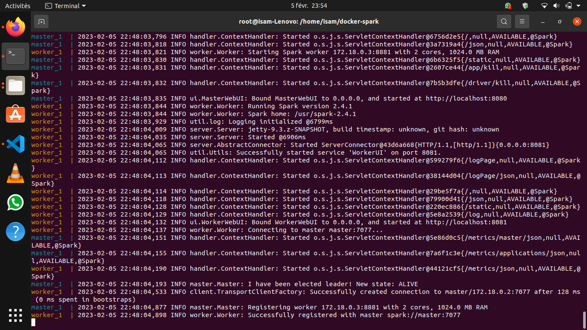

# Gestion et analyse de données avec Spark


## About The Project
『 EN COUR DE REALISATION 』    

Simulation de l'envirenemment Spark pour gérer et analyser des fichiers brutes de données


### Keywords

Apache, Spark, PySpark, Docker, Ubuntu

## Installation

Installer en premier lieu `docker` sur ``ubuntu`` avec les commandes suivantes

```bash
sudo apt-get update
```

```bash
sudo apt-get install \
  ca-certificates \
  curl \
  gnupg \
  lsb-release
```

```bash
sudo mkdir -p /etc/apt/keyrings
```

```bash
curl -fsSL https://download.docker.com/linux/ubuntu/gpg | sudo gpg --dearmor -o /etc/apt/keyrings/docker.gpg
```

```bash
echo \
  "deb [arch=$(dpkg --print-architecture) signed-by=/etc/apt/keyrings/docker.gpg] https://download.docker.com/linux/ubuntu \
  $(lsb_release -cs) stable" | sudo tee /etc/apt/sources.list.d/docker.list > /dev/null
```

```bash
sudo apt-get install docker-ce docker-ce-cli containerd.io docker-compose-plugin
```

Verifier que tous est bien installé

```bash
sudo docker run hello-world
```


## Usage


Récupérer l'image ``Spark``

```bash
docker pull gettyimages/spark
```
Clonner le repo git de l'image présent [ici](https://github.com/gettyimages/docker-spark.git)
```bash
git clone https://github.com/gettyimages/docker-spark.git
```

Création des contenaires à partir du fichier `yml`
```bash
docker-compose up
```
Lancement du master et du worker



```bash

```


```bash

```


```bash

```


## License

[GPL-3.0](https://choosealicense.com/licenses/gpl-3.0/)


## Contact

📫 How to reach me: kebiri.isam.dine@gmail.com

🌐 My Portfolio: <https://kebiri-isam-dine.github.io/>

🔗 Project Link: <https://github.com/kebiri-isam-dine/Gestion-et-analyse-de-donnees-avec-Spark>
